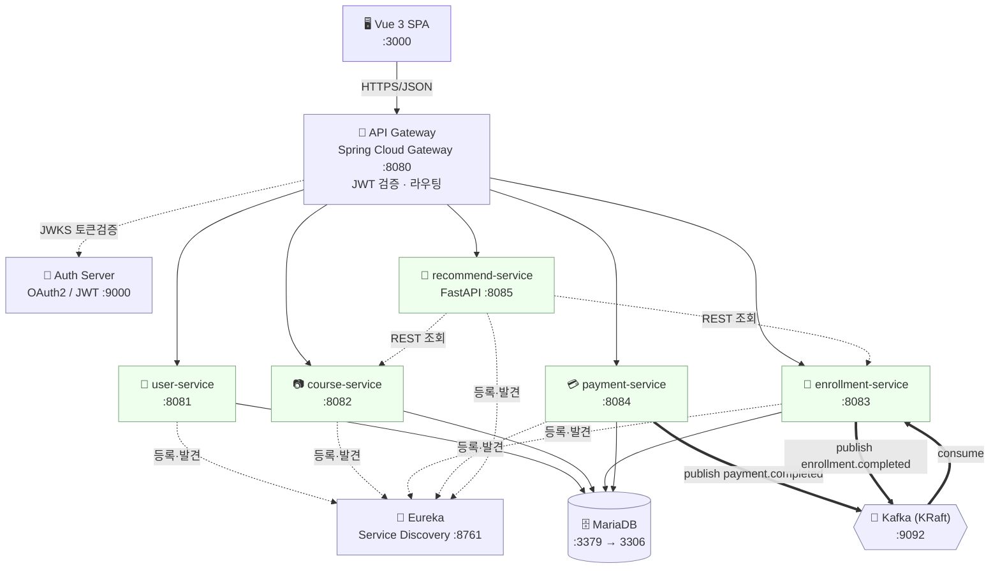
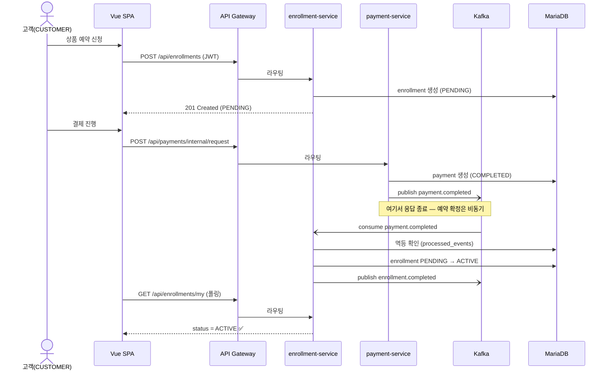
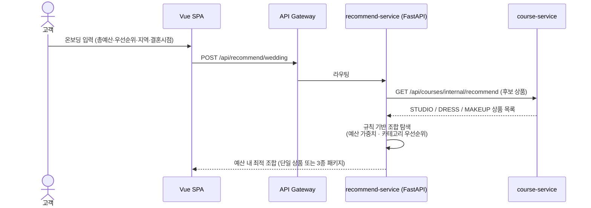
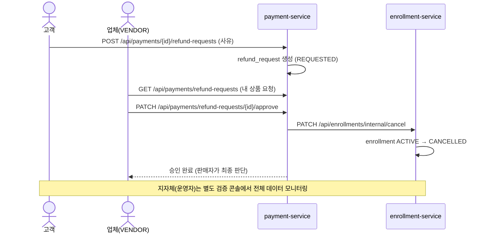
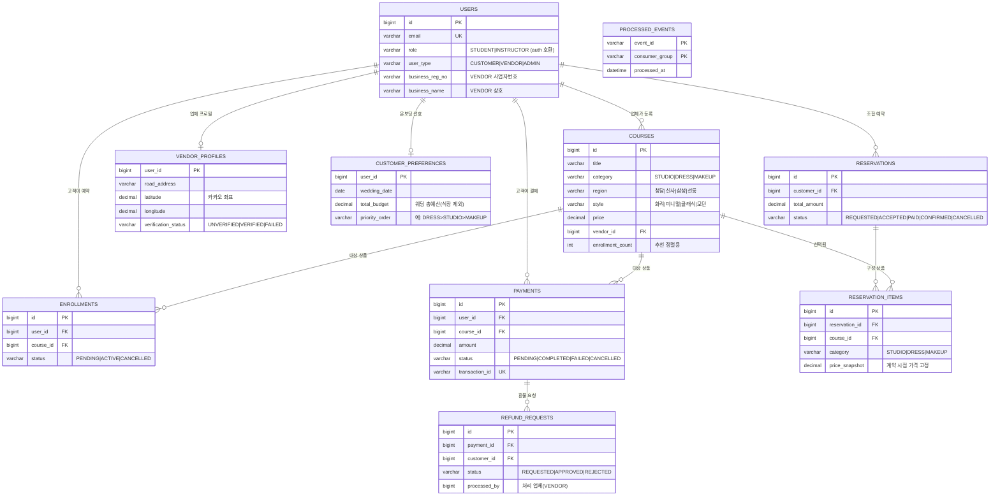

# EventFIT (8반 6조) — 제출물 안내

## 📦 제출물 구성
- `기획서_EventFIT_8반6조.pdf` — 기획 · 아키텍처 · 시연 발표자료 (29p)
- `frontend/` — Vue 3 프론트엔드 전체 소스 (실행: `npm install && npm run dev` → :3000)
- `backend_수정파일/` — 팀이 수정·추가한 백엔드 파일 (아래 **1:1 디렉토리 매핑** 참조)

> 백엔드 수정 파일은 강의 템플릿 원본에 **같은 경로로 덮어쓰기**하면 반영됩니다. `eureka-server`·`auth-server`·`api-gateway`는 인프라(수정 금지)라 제외.

---

# 백엔드 수정·추가 파일 — 디렉토리 매핑

> **EventFIT** (8반 6조) · 강의 템플릿(`msa-lecture-homework`) 대비 **팀이 수정·추가한 백엔드 파일만** 포함합니다.  
> `eureka-server` · `auth-server` · `api-gateway`는 **인프라(수정 금지)** 라 제외 · 전체 백엔드 코드는 미포함 · 🟢신규 외에는 모두 기존 파일 수정입니다.

## 반영 방법
원본 템플릿에 이 폴더 파일들을 **같은 경로로 덮어쓰기** 후 `docker compose build <서비스명> && docker compose up -d`. (실행 상세는 저장소 `README.md` §빠른 시작)

## 서비스별 요약

| 서비스 | 도메인 | 수정 | 신규 | 핵심 변경 |
|---|---|--:|--:|---|
| `user-service` | 회원 | 7 | 0 | role→user_type 도메인 역할 |
| `course-service` | 상품(웨딩) | 9 | 0 | 웨딩 상품(스튜디오·드레스·메이크업) 도메인 |
| `enrollment-service` | 예약 | 13 | 2 | 결제완료 Kafka 소비 → 예약 자동확정(멱등) |
| `payment-service` | 결제·환불 | 11 | 4 | 결제 이벤트 발행 + 환불 요청/승인 흐름 |
| `recommend-service` | AI 추천 | 9 | 1 | 예산 조합 추천 엔진(규칙 기반) |
| `init-db` | DB 초기화 | 1 | 3 | 스키마 치환 + Sprint2 테이블 + 시드 |
| **합계** |  | **50** | **10** | 총 60개 파일 |

## 디렉토리 구조 (수정·추가 파일 · 🟢신규)

```
backend_수정파일/
├── user-service/
│   ├── src/main/
│   │   ├── java/com/lecture/user/
│   │   │   ├── config/
│   │   │   │   └── SecurityConfig.java              # JWT 리소스 서버 설정 유지·경로 치환
│   │   │   ├── controller/
│   │   │   │   └── UserController.java              # /me 등 회원 조회 엔드포인트 치환
│   │   │   ├── dto/
│   │   │   │   └── UserDto.java                     # 가입/응답 DTO 도메인 필드 확장
│   │   │   ├── entity/
│   │   │   │   └── User.java                        # 도메인 역할 user_type(CUSTOMER/VENDOR/ADMIN)·사업자번호 컬럼 추가
│   │   │   └── service/
│   │   │       └── UserService.java                  # 회원 유형 분기·resolveUserType 로직
│   │   └── resources/
│   │       └── application.yml                        # 도메인 의미 치환 (경로·토픽 계약 유지)
│   └── Dockerfile                                      # 컨테이너 빌드 설정
├── course-service/
│   ├── src/main/
│   │   ├── java/com/lecture/course/
│   │   │   ├── config/
│   │   │   │   └── SecurityConfig.java              # JWT 리소스 서버 설정 유지·경로 치환
│   │   │   ├── controller/
│   │   │   │   └── CourseController.java            # 상품 등록/목록/카테고리/내부추천 엔드포인트
│   │   │   ├── dto/
│   │   │   │   └── CourseDto.java                   # 상품 DTO 확장
│   │   │   ├── entity/
│   │   │   │   └── Course.java                      # 웨딩 상품: category(STUDIO/DRESS/MAKEUP)·region·style·vendor
│   │   │   ├── repository/
│   │   │   │   └── CourseRepository.java            # 필터 쿼리 추가
│   │   │   ├── service/
│   │   │   │   └── CourseService.java               # 지역·스타일·카테고리 필터·추천 후보 조회
│   │   │   └── CourseServiceApplication.java         # 앱 부트스트랩
│   │   └── resources/
│   │       └── application.yml                        # 도메인 의미 치환 (경로·토픽 계약 유지)
│   └── Dockerfile                                      # 컨테이너 빌드 설정
├── enrollment-service/
│   ├── src/main/
│   │   ├── java/com/lecture/enrollment/
│   │   │   ├── config/
│   │   │   │   └── SecurityConfig.java              # JWT 리소스 서버 설정 유지·경로 치환
│   │   │   ├── controller/
│   │   │   │   └── EnrollmentController.java        # 도메인 치환/기능 확장
│   │   │   ├── dto/
│   │   │   │   └── EnrollmentDto.java               # 예약 DTO 확장
│   │   │   ├── entity/
│   │   │   │   ├── Enrollment.java                  # 예약 상태(PENDING/ACTIVE/CANCELLED)
│   │   │   │   └── ProcessedEvent.java 🟢신규       # Kafka 멱등 처리용 엔티티
│   │   │   ├── kafka/
│   │   │   │   ├── EnrollmentKafkaConsumer.java     # payment.completed 소비 → 예약 PENDING→ACTIVE 자동 확정
│   │   │   │   └── KafkaEvent.java                  # Kafka payload 필드 확장
│   │   │   ├── repository/
│   │   │   │   ├── EnrollmentRepository.java        # 저장소 확장
│   │   │   │   └── ProcessedEventRepository.java 🟢신규  # 멱등 이벤트 저장소
│   │   │   └── service/
│   │   │       ├── CourseServiceClient.java          # 상품 존재 확인 REST 클라이언트
│   │   │       ├── EnrollmentService.java            # 자동 확정·멱등·상품 확인 로직
│   │   │       ├── EnrollmentWriteService.java       # PENDING 생성 쓰기 트랜잭션
│   │   │       └── PaymentServiceClient.java         # 결제 요청 REST 클라이언트
│   │   └── resources/
│   │       └── application.yml                        # 도메인 의미 치환 (경로·토픽 계약 유지)
│   └── Dockerfile                                      # 컨테이너 빌드 설정
├── payment-service/
│   ├── src/main/
│   │   ├── java/com/lecture/payment/
│   │   │   ├── config/
│   │   │   │   ├── GlobalExceptionHandler.java      # 전역 예외 처리
│   │   │   │   ├── SecurityConfig.java              # JWT 리소스 서버 설정 유지·경로 치환
│   │   │   │   └── WebClientConfig.java 🟢신규      # 서비스 간 REST 호출용 WebClient
│   │   │   ├── controller/
│   │   │   │   └── PaymentController.java           # 결제 요청·환불 요청/승인/반려 엔드포인트
│   │   │   ├── dto/
│   │   │   │   └── PaymentDto.java                  # 결제/환불 DTO
│   │   │   ├── entity/
│   │   │   │   ├── Payment.java                     # 결제 상태에 REFUNDED 추가
│   │   │   │   └── RefundRequest.java 🟢신규        # 환불 요청 엔티티(refund_requests)
│   │   │   ├── kafka/
│   │   │   │   └── PaymentKafkaProducer.java        # payment.completed 이벤트 발행(eventId 포함)
│   │   │   ├── repository/
│   │   │   │   ├── PaymentRepository.java           # 결제 저장소
│   │   │   │   └── RefundRequestRepository.java 🟢신규  # 환불 요청 저장소
│   │   │   └── service/
│   │   │       ├── EnrollmentServiceClient.java 🟢신규  # 환불 승인 시 예약 취소 연동
│   │   │       └── PaymentService.java               # 결제완료→이벤트 발행·환불 상태머신
│   │   └── resources/
│   │       └── application.yml                        # 도메인 의미 치환 (경로·토픽 계약 유지)
│   ├── Dockerfile                                      # 컨테이너 빌드 설정
│   └── build.gradle                                    # 의존성 추가(WebFlux 등)
├── recommend-service/
│   ├── app/
│   │   ├── client/
│   │   │   ├── course_client.py                      # course-service 조회 클라이언트
│   │   │   └── enrollment_client.py                  # enrollment-service 조회 클라이언트
│   │   ├── config/
│   │   │   └── security.py                           # JWT 검증 설정
│   │   ├── kafka/
│   │   │   └── consumer.py                           # enrollment.completed 소비(이용 데이터)
│   │   ├── model/
│   │   │   └── schemas.py                            # 추천 요청/응답 스키마(총예산·우선순위·스타일)
│   │   ├── router/
│   │   │   └── recommend_router.py                   # /wedding·/tiers 추천 라우터
│   │   └── service/
│   │       ├── recommend_service.py                   # 추천 서비스 진입점
│   │       └── wedding_service.py 🟢신규              # 웨딩 예산 조합 추천 엔진(점수·조합탐색·예산검증·이유)
│   ├── main.py                                         # FastAPI 앱 구성
│   └── requirements.txt                                # 의존성 (DB 드라이버 없음 = 무상태)
└── init-db/
    ├── 01_init.sql                                      # 스키마를 웨딩 도메인으로 치환(users.user_type 등)
    ├── 02_mock_data.sql 🟢신규                          # 시연용 시드(계정·상품 15종)
    ├── 03_sprint2.sql 🟢신규                            # Sprint2 테이블(preference·refund·reservation·vendor·processed_events)
    └── kakao_vendors.json 🟢신규                        # 카카오 로컬 API 수집 업체 좌표 시드
```
---

# 시스템 설계 (아키텍처 · 시퀀스 · Kafka · ERD · API)

> 아래 다이어그램은 mermaid로 작성 (GitHub·VS Code 등에서 렌더). 발표 기획서 PDF에 시각화 버전 포함.

## 🏗️ 시스템 아키텍처

단일 진입점(API Gateway)에서 JWT를 검증하고 Eureka로 서비스를 찾아 라우팅합니다.
동기 흐름은 REST, **결제→예약 확정**처럼 서비스 경계를 넘는 상태 전파는 **Kafka 이벤트(비동기)** 로 처리합니다.



**설계 원칙**

- **API Gateway 단일 진입** — 클라이언트는 개별 서비스(8081~8085)를 직접 호출하지 않고 항상 `:8080` 경유. 인증·CORS·라우팅을 한 곳에서.
- **서비스 디스커버리(Eureka)** — 서비스는 호스트/포트를 하드코딩하지 않고 서비스명으로 서로를 찾음.
- **DDD Bounded Context = 서비스 경계** — 회원/상품/예약/결제/추천이 각자의 책임과 데이터 소유.
- **이벤트 기반 통신** — 결제 완료 사실을 Kafka로 발행, 예약 서비스가 구독해 상태를 자동 전이(느슨한 결합).
- **인프라 불변 계약** — `eureka-server`·`auth-server`·`api-gateway`는 강의 제공 인프라로 **수정 금지**. 라우팅 경로·Kafka 토픽 구조·JWT 계약을 유지하고 도메인 의미만 치환.

## 🔀 요청 흐름 · 시퀀스 다이어그램

### 1) 예약 → 결제 → Kafka → 자동 확정 (이벤트 기반 통신의 핵심)

결제 완료를 **동기 응답으로 예약을 바꾸지 않고**, `payment.completed` 이벤트를 발행하면
예약 서비스가 이를 구독해 상태를 자동 전이합니다. 서비스 간 결합을 끊는 MSA 핵심 패턴입니다.



### 2) AI 예산 조합 추천 (온보딩 → 규칙 엔진)



### 3) 환불 — 고객 요청 → 업체(VENDOR)가 직접 승인 (Human-in-the-loop)

> 환불·CS 같은 운영은 **판매자(업체)** 가 직접 처리합니다. **지자체(운영자)** 는 승인 주체가 아니라, 쌓인 데이터를 **통합 검증·모니터링**하는 역할(신뢰·검증)만 맡습니다.



---

## 📨 이벤트(Kafka) 설계

KRaft 모드 단일 브로커. 서비스 경계를 넘는 상태 전파를 이벤트로 처리합니다.

| 토픽 | 생산자 | 소비자 | 키 | 의미 |
|---|---|---|---|---|
| `payment.completed` | payment-service | enrollment-service | `userId` | 결제 완료 → 예약 확정 트리거 |
| `enrollment.completed` | enrollment-service | (추천 갱신 등 확장) | `userId` | 예약 확정 사실 발행 |

- **멱등성(Idempotency)**: `processed_events(event_id, consumer_group)` 테이블로 **중복 소비 방지**.
  같은 이벤트가 재전달돼도 예약이 두 번 확정되지 않습니다.
- **파티션 키 = userId**: 동일 사용자 이벤트의 순서를 보장.
- **계약 유지**: 토픽명·Producer/Consumer 구조는 인프라 계약이라 유지하고, **payload 필드만 도메인에 맞게 확장**했습니다.

---

## 🗄️ 데이터 모델 (ERD)

Sprint 1(회원·상품·예약·결제) + Sprint 2(온보딩 선호·조합 예약·환불·업체 프로필·이벤트 멱등).



---

## 📋 API 명세

모든 외부 요청은 **API Gateway(`:8080`)** 를 경유합니다. `internal/*` 경로는 서비스 간 내부 호출용입니다.
전체 상세는 각 서비스 Swagger UI(`/swagger-ui/index.html`), recommend는 `/docs` 참고.

### 👤 user-service `/api/users`

| Method | Path | 설명 |
|---|---|---|
| POST | `/register` | 회원 가입 (VENDOR는 사업자등록번호 필수) |
| GET | `/me` | 내 정보 (JWT) |
| GET | `/{id}` | 회원 단건 조회 |
| GET | `/internal/{id}` | (내부) 회원 조회 |

### 📷 course-service `/api/courses`

| Method | Path | 설명 |
|---|---|---|
| POST | `/` | 웨딩 상품 등록 (VENDOR) |
| GET | `/` | 상품 목록 (region·style·category 필터) |
| GET | `/{id}` | 상품 상세 |
| GET | `/category/{category}` | 카테고리별(STUDIO/DRESS/MAKEUP) 목록 |
| GET | `/internal/recommend` | (내부) 추천 후보 상품 |
| POST | `/internal/{id}/enrollment-count` | (내부) 예약 수 증가 |

### 📝 enrollment-service `/api/enrollments`

| Method | Path | 설명 |
|---|---|---|
| POST | `/` | 예약 신청 (→ PENDING) |
| GET | `/my` | 내 예약 목록 (JWT) |
| GET | `/user/{userId}` | 사용자 예약 목록 |
| PATCH | `/internal/cancel` | (내부) 예약 취소 — 환불 승인 시 payment-service가 호출 |
| GET | `/internal/history/{userId}` | (내부) 예약 이력 (추천용) |

### 💳 payment-service `/api/payments`

| Method | Path | 설명 |
|---|---|---|
| POST | `/internal/request` | 결제 요청 → 완료 시 `payment.completed` 발행 |
| POST | `/{paymentId}/refund-requests` | 환불 요청 생성 (고객) |
| GET | `/refund-requests` | 환불 요청 목록 (업체=내 상품 / 지자체=전체 모니터링) |
| PATCH | `/refund-requests/{id}/approve` | 환불 승인 (업체가 직접) → 예약 취소 연동 |
| PATCH | `/refund-requests/{id}/reject` | 환불 반려 (업체가 직접) |
| GET | `/{id}` · `/user/{userId}` | 결제 조회 |

### 🤖 recommend-service `/api/recommend` (FastAPI)

| Method | Path | 설명 |
|---|---|---|
| GET | `/tiers` | 예산 3구간(가성비·스탠다드·럭셔리) 기준 |
| POST | `/wedding` | 예산·우선순위 기반 조합 추천 (규칙 엔진) |
| GET | `/{user_id}` | 사용자 이력 기반 추천 |

---
